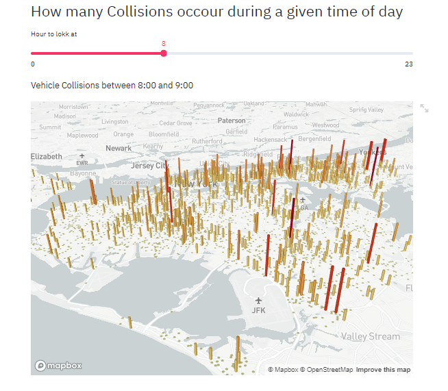

# Web-App-for-NYC-Accident-Data-with-Streamlit
It uses a python code to build a Web based Dashboard with interactive Visualization 
It Utilises a CSV Databse <a href="https://drive.google.com/file/d/1LwGue1rxa0G60CKF7Ryi-RmH4kcn2-qS/view?usp=sharing">Motor_Vehicle_Collisions_-_Crashes</a>, With more than a Million Rows.  
This Program uses Streamlit Python Libray for web development and Pydesk to add layers in the Map Visulaization.

# Screenshots

   
  This Image shows the first Feature of the Web App, which is a 2D Map of NYC, showing the places with injued people as 5

 

   
  This Image shows the Second Feature of the Web App, which is a 3D Map of NYC, showing the places with highest number of Accident at a perticular hour of the Day

   
  This Image shows the Third Feature of the Web App, It shows the top 5 Dangerour Places, for Pedestriants, Cyclist and Motorbikers

# Description 
This App uses Python for Web Development, which is more convinient than HTML & CSS, as it has the Code for Backend and Front end in a single Script, and can do Complex Visualizations in small lines Codes.  
 
this Code has UI Elements such as Slider Bar, Selection Box and Side Panel. 
Adding Layers to the Map is done by thr Pydeck Library, we Can add as many layers as we like on the Map, according to our Data and Use
